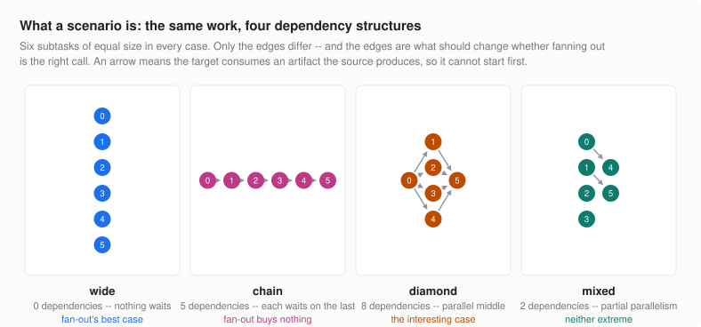

# Delegation Regret

**When should an AI agent spawn subagents, and when should it just do the work itself?**

Delegation is Amdahl's law with a spawn tax: the serial fraction bounds the speedup, and every subagent buys parallelism at a fixed price. This repo measures that decision empirically — how many dollars fan-out adds, how many minutes it saves, and the break-even price of latency `beta* = (fan-out dollars − serial dollars) / (serial minutes − fan-out minutes)` at which the trade is worth it.



A scenario is a set of equal-size subtasks plus a dependency structure, rendered as a Python package with failing tests to repair. The structure is the experimental variable: on `wide` every subtask can run at once, on `chain` nothing overlaps and fan-out can only lose. Same work, opposite correct answers — both derived, neither asserted.

## How it works

```
generator/   DAG scenarios + executable defect payload (balanced defects, import-edge deps)
    ↓
oracle       exhaustive plan enumeration, calibrated cost model, latency simulation,
             optimal-k intervals over the β axis
    ↓
harness/     the agent loop: real subagent spawns on a capped pool, both wire formats
             over real HTTP, every run witnessed by an independent logging proxy
    ↓
scoring/     delegation regret, implied β, execution-verified success gates
    ↓
audit        committee audit executes every plan that could win; findings scripts
             recompute every reported number from saved traces, exiting nonzero on drift
```

Success is execution-verified (restored test suites in a clean subprocess — no LLM judge). Dollars come from provider usage against dated price sheets; minutes come from a calibrated analytic clock over the observed call schedule. A trace whose usage disagrees with the proxy is disqualified.

## Quick start

Python 3.9+, standard library only (verified on 3.9 and 3.14).

```bash
git clone https://github.com/EdithJin/delegation-regret
cd delegation-regret
python -m generator.demo               # ~2s tour: shapes, oracle decisions, the β axis
python -m unittest discover -s tests   # 371 tests, offline, no API key
```

## Running the instrument

Offline, no credentials:

```bash
python -m harness.smoke preflight      # verify the instrument; zero API calls
python -m harness.cli models           # print the pinned price sheets
python -m harness.cli manifest --set core   # write the fingerprinted scenario manifest
```

Live runs read the key from `ANTHROPIC_API_KEY` (override with `--api-key-env`; the OSS leg uses `OPENAI_API_KEY`-style env selection):

```bash
python -m harness.cli calibrate ...    # measure provider cost/timing constants, write traces
python -m harness.cli experiment ...   # manifest in → stamped results file out
python probe.py ...                    # paired serial vs max-fanout boundary probe
python matrix.py ...                   # one behavioral cell per fresh process
python -m harness.cli audit ...        # execute every plan that could win
python -m harness.cli audit-summary <dir>
```

Each command's `--help` documents its arguments; the experiment driver refuses to write a results file missing its manifest fingerprint, calibration source, or price-sheet date.

## Reproducing the findings

The full trace archive stays out of history. Where it is present under `results/`, every reported number regenerates from artifacts:

```bash
python opus_findings.py     # Opus tallies, boundary ladder, audit assertions
python gpt_findings.py      # GPT leg
python kimi_findings.py     # Kimi K3 leg
python billing_audit.py     # recheck every saved trace/proxy pair and ledger
```

Figures rebuild with matplotlib: `python figures/make_fig1.py` (PDF output directory via `FIG_PDF_DIR`, default `figures/`).

## Layout

| | |
|---|---|
| [`generator/demo.py`](generator/demo.py) | Start here — the whole instrument in five printed sections |
| [`generator/oracle.py`](generator/oracle.py) | Plan space, feasibility, schedule simulation, implied β |
| [`generator/templates.py`](generator/templates.py) | The executable payload: modules, defect injection, generated suites |
| [`harness/runner.py`](harness/runner.py) | The agent loop, real `spawn_subagent`, forced-plan baseline |
| [`harness/proxy.py`](harness/proxy.py) | The independent billing witness every run routes through |
| [`scoring/regret.py`](scoring/regret.py) | Regret, what it refuses to score, implied β |
| [`harness/audit.py`](harness/audit.py) | The committee audit and its structural cross-check |
| [`tests/`](tests/) | What is actually guaranteed, including regression pins for every correction |

MIT licensed. *Research project, built independently. Questions and objections are welcome — open an issue.*
